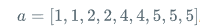
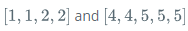

Problem
 Given an array of integers, find and print the maximum number of integers you can select from the array such that the absolute difference between any two of the chosen integerts is less than or equal to 1.
 For example, if your array is  , you can create two subarrays meeting the criterion:  .The maximum length subarray has 5 elements
 
 
Function Description
 The first line contains a single integer, n, denoting the size of the array
 The second line contains n space-separated integers describing the respective values of a,b,c...
 

Constraints
 2 <= n <= 100
 0 < a < 100
 The answer will be >= 2
 
Output Format
 A single integer denoting the maximum number of integers you can choose from the array such that the absolute difference between any two of the chosen integers is <= 1
 
Explanation
 We choose the following multiset of integers from the array
 Each pair in the multiset has an absolute difference,  so we print the number of chosen integers.
 
Explanation1
 We choose the following multiset of integers from the array
 Each pair in the multiset has an absolute diffrence, so we print the number of chosen integers,  5, as our answer.